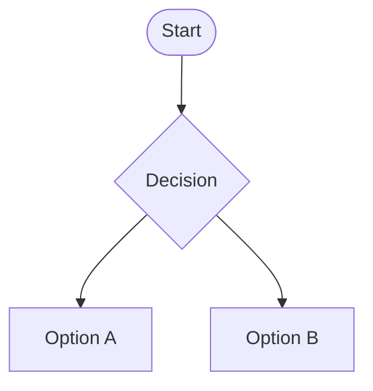
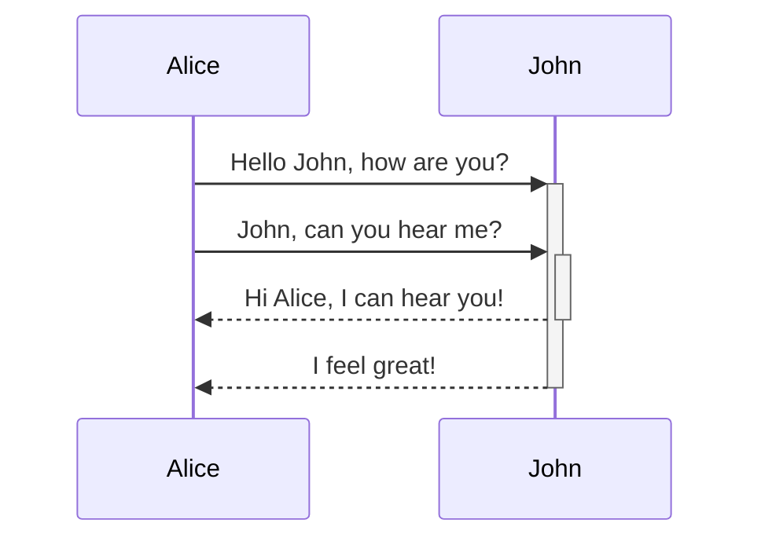

## Images

### Image from same directory

Rosy maple moth](moth.jpg)

### External image sample


### Image from other directory


## Table styling

| head 1       | head 2       | head 3     |
| ------------ | ------------ | ---------- |
| *row 1*      | row 1        | longer row |
| row 2        | **row 2**    | row 2      |
| longer row 3 | row 3        | row 3      |
| row 4        | longer row 4 | row 4      |


## Text styles

# Heading 1

## Heading 2

### Heading 3

#### Heading 4

##### Heading 5

###### Heading 6

**Bold**

*Italics*

***Italics Bold***

==Highlight==

~~strikethrough~~
### This is a quote

> **Lorem Ipsum** is simply dummy text of the printing and typesetting industry. Lorem Ipsum has been the industry's standard dummy text ever since the 1500s, when an unknown printer took a galley of type and scrambled it to make a type specimen book. It has survived not only five centuries, but also the leap into electronic typesetting, remaining essentially unchanged. It was popularized in the 1960s with the release of Letraset sheets containing Lorem Ipsum passages, and more recently with desktop publishing software like Aldus PageMaker including versions of Lorem Ipsum.


Sample text Sample text Sample text Sample text Sample text Sample text Sample text Sample text Sample text Sample text Sample text

* Bullet list one
* Bullet list two
* Bullet list three 

Sample text Sample text Sample text Sample text Sample text Sample text Sample text Sample text Sample text Sample text Sample text


- Item 1
	- sub
	- sub
	- sub
- Item 2
	- sub
- Item 3

1. Item
	1. sub
	2. sub
2. Item
3. Item

- [ ] Task
- [x] Task
- [ ] Task


```
cd ~/Desktop
dir /b
```


```js
function fancyAlert(arg) {
  if(arg) {
    $.facebox({div:'#foo'})
  }
}
```

### Footnotes

This is a line with a foot note reference [^1]

[^1]: This is the foot note itself


You can also use inline footnotes. ^[This is an inline footnote.]


### Callouts

> [!note] Note
> General information or reminders.

> [!abstract] Abstract
> Summarizes content. Also accepts: `summary`, `tldr`.

> [!info] Info
> Informational asides and context.

> [!todo] Todo
> Action items or task lists.

> [!tip] Tip
> Helpful hints and best practices. Also accepts: `hint`, `important`.

> [!success] Success
> Indicates a positive outcome. Also accepts: `check`, `done`.

> [!question] Question
> Frequently asked questions or open questions. Also accepts: `help`, `faq`.

> [!warning] Warning
> Something to watch out for. Also accepts: `caution`, `attention`.

> [!failure] Failure
> Something went wrong or is missing. Also accepts: `fail`, `missing`.

> [!danger] Danger
> A critical issue or destructive action. Also accepts: `error`.

> [!bug] Bug
> A known bug or unexpected behavior.

> [!example] Example
> A demonstration or code sample.

> [!quote] Quote
> A quotation or citation. Also accepts: `cite`.

> [!tip]+ Foldable — starts expanded
> Click the title bar to collapse this callout.

> [!warning]- Foldable — starts collapsed
> This callout starts collapsed. Click the title to expand it.


## Linking tests


[External links like Obsidian Help](https://help.obsidian.md)

[/get-help/contact-it/](/get-help/contact-it/)

[Internal ink to same section Text styles](Text%20styles.md)


## Mermaid charts







